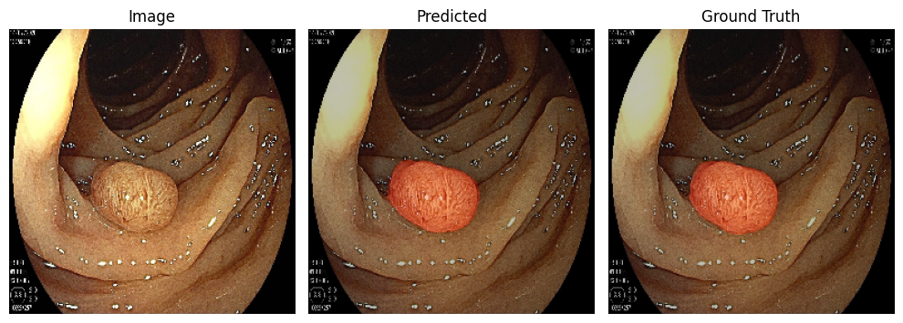
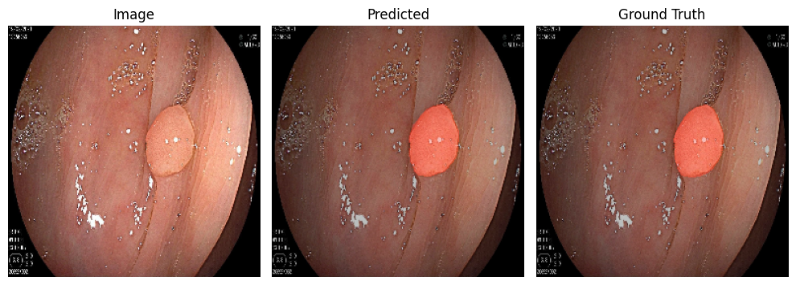
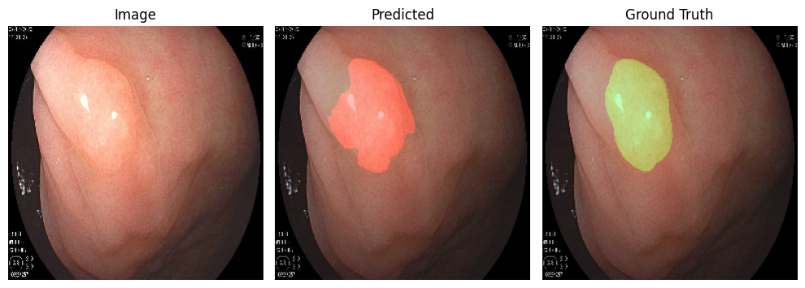
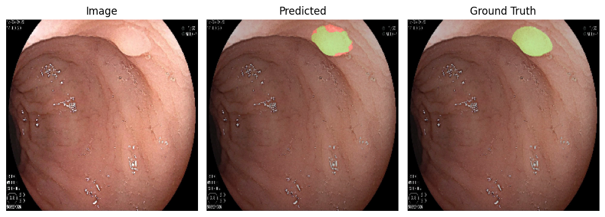

# Project on Polyps Segmentation in Endoscopy Images

This project aims to develop two deep learning models with the base architecture of U-Net for the segmentation of polyps in endoscopy images and to compare their performance. The dataset used for this project is from [BKAI-IGH NeoPolyp](https://www.kaggle.com/c/bkai-igh-neopolyp/) competition on Kaggle. The analysis is conducted on the 1000 available images with a train-test split of 795-205 images, different from the kaggle competition settings. The jupyter notebook are run on Google Colab with V100 or A100 GPU support.

## Data Preprocessing
Colours of the masks are recoded to 3 classes. Images and masks are cropped and augmented. Class weights are calculated using the training set distribution to handle the class imbalance.

## Models and Hyperparameters
The first model is a baseline U-Net and the second model is a U-Net with attention gates. The hyperparameters are as follows for each model:
| Hyperparameters | Set 1 | Set 2 | Set 3 | Set 4 |
|---|---|---|---|---|
| loss function | Weighted Cross Entropy |  Weighted Cross Entropy | Dice Loss | Dice Loss |
| learning rate $\alpha$ | `1e-4`, i.e. `0.0001` | `1e-5`, i.e. `0.00005`|`1e-4`, i.e. `0.0001` | `1e-5`, i.e. `0.00005`|
| batch size | `32` | `32` | `32` | `32` |
| epochs | `250` | `250` | `250` | `250` |

## Results
Both models are trained and tested on the same dataset. A classification report and a confusion matrix are generated for the best baseline and attention models, selected base on the highest validation dice score.

Sample plots of deep features are visualised to compare the influence of attention gates on the feature maps.

Some predictions:

### Note
The new data split detail are included in `train.txt` and `test.txt` files, where IDs of the images in each set are specified.

Previously, I used Google Colab Pro for training and testing the models, which provides access to V100 and A100 GPUs. A recommended way to train the model is to extract and refactor the functions to python files available for running on local machines with GPUs.

## References
1. Lan, P.N., An, N.S., Hang, D.V., Long, D.V., Trung, T.Q., Thuy, N.T., Sang, D.V.: [NeoUnet: Towards accurate colon polyp segmentation and neoplasm detection](https://link.springer.com/chapter/10.1007/978-3-030-90436-4_2). In: Proceedings of the 16th International Symposium on Visual Computing (2021)
2. Nguyen Thanh Duc, Nguyen Thi Oanh, Nguyen Thi Thuy, Tran Minh Triet, Dinh Viet Sang. [ColonFormer: An Efficient Transformer Based Method for Colon Polyp Segmentation](https://ieeexplore.ieee.org/document/9845389). IEEE Access, vol. 10, pp. 80575-80586, 2022
3. Nguyen Hoang Thuan, Nguyen Thi Oanh, Nguyen Thi Thuy, Perry Stuart, Dinh Viet Sang (2023). [RaBiT: An Efficient Transformer using Bidirectional Feature Pyramid Network with Reverse Attention for Colon Polyp Segmentation](https://arxiv.org/abs/2307.06420). arXiv preprint arXiv:2307.06420.
4. Nguyen Sy An, Phan Ngoc Lan, Dao Viet Hang, Dao Van Long, Tran Quang Trung, Nguyen Thi Thuy, Dinh Viet Sang. [BlazeNeo: Blazing fast polyp segmentation and neoplasm detection](https://ieeexplore.ieee.org/document/9759450). IEEE Access, Vol. 10, 2022.